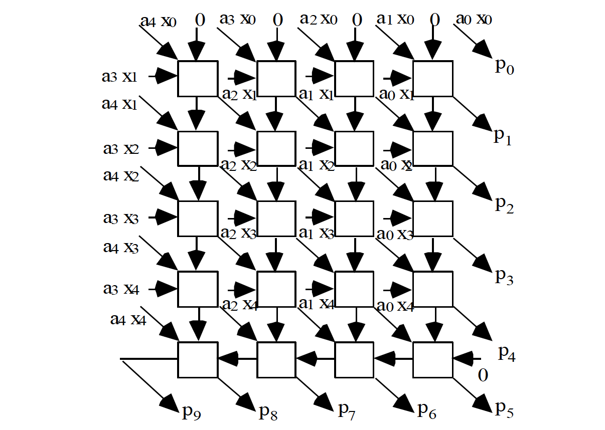
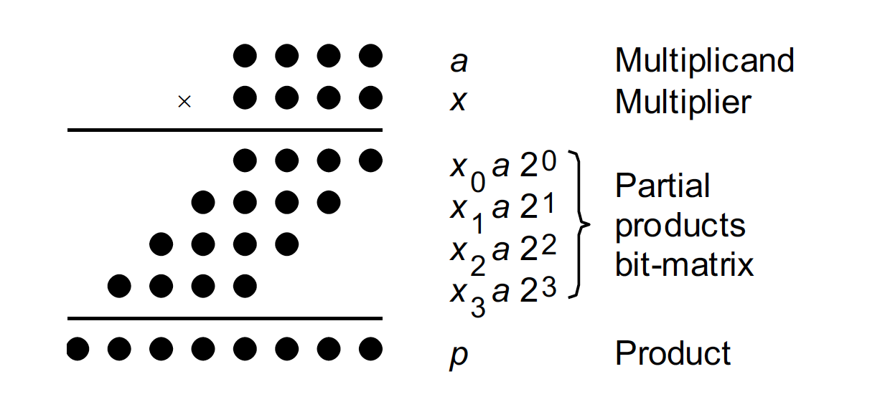

# ECE 524L Fall 2021
**California State University, Northridge**  
**Department of Electrical and Computer Engineering**  

## Lab 8 - Pipelining

## Objective

After completing this lab, students will be able to:
- Exercise pipelining technique on FPGA
- Design of an array unsigned multiplier VHDL
- Using Pipelining technique to improve performance
- Simulation and timing analysis

## Requirements

The following material is required to complete the lab:
- Xilinx Vivado 2019.1

## References

- Xilinx FPGA datasheets (available at http://www.xilinx.com)
- Software Manual (available at http://www.support.xilinx.com)
- VHDL reference guide (available at http://www.acc-eda.com/vhdlref)
- Wikipedia (http://en.wikipedia.org/wiki/Bitonic_sorter)

## Introduction

The goal of this lab at the first step will be to design an unsigned combinational array multiplier and measure its performance using timing analysis tools. In the next step, we apply the pipelining technique at different levels to explore the design space. The multiplier basic building block is designed using behavioral modeling and the complete design uses structural modeling using arrays and generate statements. Figure 8.1 shows the block diagram of the combinational 5x5 unsigned array multiplier. 

Figure 8.1 Block diagram for 5x5 array multiplier

Notation for our of multiplication algorithms:

| Parameter | operation part | formula |
| -- | -- | -- |
| a | Multiplicand | `(a_[k–1])(a_[k–2]) ... (a_[1])(a_[0])` |
| x | Multiplier | `(x_[k–1])(x_[k–2])...(x_[1])(x_[0])` |
| p | Product `(a * x)` | ` (p_[2k–1])(p_[2k–2])...(p_[3])(p_[2])(p_[1])(p_[0])` |

Initially, we assume unsigned operands. Figure 8.2 shows the multiplication operation in dot notation.

Figure 8.2 Multiplication in dot notation

## Procedure

:point_right: **Task 1:** Design the unsigned 32x32 array multiplier similar to what is shown in Figure 8.1. Measure the critical path delay using timing analysis tools.  

:point_right: **Task 2:** Use pipelining technique to double the performance.  

:point_right: **Task 3:** Use pipelining technique to triple the performance.  

:point_right: **Task 4:** Use pipelining technique to maximize performance.  

:point_right: **Task 5:** Simulate your design for each case.  

:point_right: **Task 6:** Use timing analysis tools to prove the application of each method for each case of the pipelining.  

:point_right: **Task 7:** Study the performance are trade-offs.  
